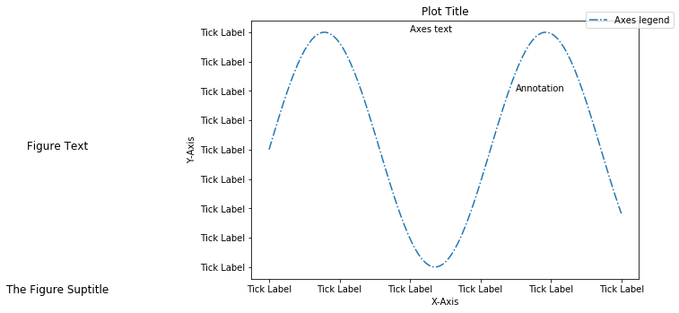

#一.素材
https://python-graph-gallery.com/

可以考虑从中得到想要的图形，反查。

#二.Matplotlib
##基础知识
###基本概念
Figure：绘制面板，画布，其中可以包涵多个Axes（即多个图表）

Axes：本意指坐标轴，这里引申为图表

axis：坐标轴



##两种基本做法
###1.fig=plt.figure，然后ax = fig.add_subplots，最后ax画图。（适合多图）
```python
import matplotlib.pyplot as plt
fig = plt.figure()
ax = fig.add_subplot(111)
ax.plot([1, 2, 3, 4], [10, 20, 25, 30], color='lightblue', linewidth=3)
ax.scatter([0.3, 3.8, 1.2, 2.5], [11, 25, 9, 26], color='darkgreen', marker='^')
ax.set_xlim(0.5, 4.5)
plt.show()
```

###2.直接plt.plot，最后plt画图。实际上fig和ax都存在，但是plt将自动将其画在对应的fig和ax上。（适合简单的单图）。
```python
import matplotlib.pyplot as plt
plt.plot([1, 2, 3, 4], [10, 20, 25, 30], color='lightblue', linewidth=3)
plt.scatter([0.3, 3.8, 1.2, 2.5], [11, 25, 9, 26], color='darkgreen', marker='^')
plt.xlim(0.5, 4.5)
plt.show()
```

##subplot的用法
###subplots比subplot可以返回多个ax。

###add_subplots和add_axes效果差不多，只是返回值不一样。

#三.Seaborn

##常用流程
<u>**引入相关包，设置sns配置，plt总归要出面plt.subplots设置画板，直接用sns来画图，如果有详细要求用axes或plt来配置，最后plt.show()**</u>
```python
#一开头引入
import seaborn as sns #for making plots
import matplotlib.pyplot as plt # for plotting
%matplotlib inline #notebook模式下，绘图时将图片内嵌在交互窗口，而不是弹出一个图片窗口

sns.set(style="white", palette="muted")
f, axes = plt.subplots(1, 1, figsize=(11, 7), sharex=True)
sns.despine()
sns.distplot(st[(st<1000)==True].values, label = 'action_num', color="r",kde=False)
#bins就是讲x数据范围内分多少个个竖条区域，每个竖条区域称为一个bin。比如4到9的数据范围分为6个，就全部覆盖了。所以需要知道最小值和最大值。但是不同数量的bin能帮助更好理解。
axes.set_xticks(range(0,1000,50))#画刻度
axes.set_yticks(range(0,140,10))
plt.tight_layout()#让布局更紧凑，好看用的
plt.grid() #网格线
plt.show()
```

##常用配置
###1.设置样式
`sns.set() #表示恢复默认主题`
####主题:既可以set_style，或set(style='')
Seaborn有5中预定义的主题：darkgrid（灰色背景+白网格）, whitegrid（白色背景+黑网格）, dark（仅灰色背景）, white（仅白色背景）和ticks（坐标轴带刻度）。默认的主题是darkgrid，修改主题可以使用set_style()函数。
```python
sns.set_style("whitegrid")  # 白色网格背景
sns.set_style("darkgrid")   # 灰色网格背景
sns.set_style("dark")       # 灰色背景
sns.set_style("white")      # 白色背景
sns.set_style("ticks")      # 四周加边框和刻度
```

####颜色:既可以set_palette，或set(palette='')
```python
sns.set_palette("muted")    # 常用
sns.set_palette("RdBu")
sns.set_palette("Blues_d")
sns.set_palette("Set1")
sns.set_palette("RdBu")
```

###2.坐标轴

####设定坐标轴刻度范围

`matplotlib.pyplot.ylim`(**args*, **\*kwargs*)  #对于异常值的作图来说，比较重要，免得范围太大，显不出重要的区域。

Get or set the *y*-limits of the current axes.

`ylim( (ymin, ymax) )  # set the ylim to ymin, ymax`

####删除坐标轴

`seaborn.despine`(*fig=None*, *ax=None*, *top=True*, *right=True*, *left=False*, *bottom=False*, *offset=None*, *trim=False*) #表示为True就是删除对应图框线

Remove the top and right spines from plot(s)

offset : int or dict, optional

Absolute distance, in points, spines should be moved away from the axes (negative values move spines inward). A single value applies to all spines; a dict can be used to set offset values per side.

trim : bool, optional

If True, limit spines to the smallest and largest major tick on each non-despined axis.

如果不需要右方和上方的坐标轴，可以使用**despine()**函数去掉。注意，使用despine()函数需要在画数据元素之后使用，并且despine()函数只有在使用white或ticks主题时，才会有效果。另外，despine()函数可以选择哪些坐标轴被隐藏。


###3.分组绘图

比如说需要在一张图上绘制两条曲线，分别是南方和北方的气温变化，分别用不同的颜色加以区分。在seaborn中用hue参数控制分组绘图。**就是对某字段用颜色来分组**。

###4.分面绘图

其实就是在一张纸上划分不同的区域，比如2*2的子区域，在不同的子区域上绘制不同的图形，在matplotlib中就是 add_subplot(2,2,1)。

如果需要分面绘图，应该使用seaborn的FacetGrid对象，seaborn的一般的绘图函数是没有分面这个参数的。


##四.函数图

###大致分类，详见onenote中的摘抄

**因子变量绘图**

1. 箱线图boxplot
2. 小提琴图violinplot
3. 散点图striplot
4. 带分布的散点图swarmplot
5. 直方图barplot
6. 计数的直方图countplot
7. 两变量关系图factorplot

**回归图** 
回归图只要探讨两连续数值变量的变化趋势情况，绘制x-y的散点图和回归曲线。

1. 线性回归图lmplot
2. 线性回归图regplot

**分布图** 
包括单变量核密度曲线，直方图，双变量多变量的联合直方图，和密度图

**热力图** 
1. 热力图heatmap

**聚类图** 
1. 聚类图clustermap

**时间序列图** 
1. 时间序列图tsplot 
2. 我的时序图plot_ts_d , plot_ts_m

**分面绘图** 
1. 分面绘图FacetGrid


###直方图（distplot）：观察单变量分布

seaborn的**displot()**集合了**matplotlib的hist()**与核函数估计**kdeplot**的功能，增加了**rugplot**分布观测条显示与利用scipy库fit拟合参数分布的新颖用途。具体用法如下：

seaborn.distplot(*a*, *bins=None*, *hist=True*, *kde=True*, *rug=False*, *fit=None*, *hist_kws=None*, *kde_kws=None*, *rug_kws=None*, *fit_kws=None*, *color=None*, *vertical=False*, *norm_hist=False*, *axlabel=None*, *label=None*, *ax=None*)

Parameters:

**a** : Series, 1d-array, or list.

> Observed data. If this is a Series object with a name attribute, the name will be used to label the data axis.

**bins** : argument for matplotlib hist(), or None, optional #设置矩形图数量

> Specification of hist bins, or None to use Freedman-Diaconis rule.

**hist** : bool, optional #控制是否显示条形图

> Whether to plot a (normed) histogram.

**kde** : bool, optional #控制是否显示核密度估计图

> Whether to plot a gaussian kernel density estimate.

**rug** : bool, optional #控制是否显示观测的小细条（边际毛毯）

> Whether to draw a rugplot on the support axis.

**fit** : random variable object, optional #控制拟合的参数分布图形

> An object with fit method, returning a tuple that can be passed to a pdf method a positional arguments following an grid of values to evaluate the pdf on.

**{hist, kde, rug, fit}_kws** : dictionaries, optional

> Keyword arguments for underlying plotting functions.

**vertical** : bool, optional #显示正交控制

> If True, oberved values are on y-axis.

```python
import seaborn as sns
import matplotlib.pyplot as plt
%matplotlib inline
sns.set(style="white", palette="muted", color_codes=True)

train = pd.read_csv('train.csv')#导入数据集
#ax1表示对获得助学金的人分布作图，ax2表示对未获得助学金的人分布作图
ax1=sns.kdeplot(train['金额'][train['是否得到助学金']==1],color='r')
ax2=sns.kdeplot(train['金额'][train['是否得到助学金']==0],color='b')
#J理解为kdeplot和displot的图一个是线，一个是图而已。
```


###箱形图（boxplot）

"盒式图"或叫"盒须图" "箱形图",，其绘制须使用常用的统计量，能提供有关数据位置和分散情况的关键信息，尤其在比较不同的母体数据时更可表现其差异。


如上图所示，标示了图中每条线表示的含义，其中应用到了分位值（数）的概念。

主要包含五个数据节点，将一组数据从大到小排列，分别计算出他的上边缘，上四分位数，中位数，下四分位数，下边缘。

箱形图的绘制步骤：

1、画数轴，度量单位大小和数据批的单位一致，起点比最小值稍小，长度比该数据批的全距稍长。

2、画一个矩形盒，两端边的位置分别对应数据批的上下四分位数（Q3和Q1）。在矩形盒内部中位数（Xm）位置画一条线段为中位线。

3、在Q3+1.5IQR（四分位距）和Q1－1.5IQR处画两条与中位线一样的线段，这两条线段为异常值截断点，称其为内限；在Q3+3IQR和Q1－3IQR处画两条线段，称其为外限。处于内限以外位置的点表示的数据都是异常值，其中在内限与外限之间的异常值为温和的异常值（mild outliers），在外限以外的为极端的异常值(extreme outliers)。四分位距=Q3-Q1。.

4、从矩形盒两端边向外各画一条线段直到不是异常值的最远点，表示该批数据正常值的分布区间。

5、用“〇”标出温和的异常值，用“*”标出极端的异常值。相同值的数据点并列标出在同一数据线位置上，不同值的数据点标在不同数据线位置上。至此一批数据的箱形图便绘出了。统计软件绘制的箱形图一般没有标出内限和外限。

seaborn.boxplot(x=None, y=None, hue=None, data=None, order=None, hue_order=None, orient=None, color=None, palette=None, saturation=0.75, width=0.8, fliersize=5, linewidth=None, whis=1.5, notch=False, ax=None, **kwargs)


Parameters:

**x, y, hue** : names of variables in data or vector data, optional #设置x,y以及颜色控制的变量

> Inputs for plotting long-form data. See examples for interpretation.

**data **: DataFrame, array, or list of arrays, optional #设置输入的数据集

> Dataset for plotting. If x and y are absent, this is interpreted as wide-form. Otherwise it is expected to be long-form. 

**order, hue_order **: lists of strings, optional #控制变量绘图的顺序

> Order to plot the categorical levels in, otherwise the levels are inferred from the data objects.

**palette** : palette name, list, or dict, optional #就是要么是palette定义好的模板名字，要么就是字典映射hue中的字段

> Colors to use for the different levels of the `hue` variable. Should be something that can be interpreted by [`color_palette()`](http://seaborn.pydata.org/generated/seaborn.color_palette.html#seaborn.color_palette), or a dictionary mapping hue levels to matplotlib colors.

```python
import seaborn as sns
sns.set_style("whitegrid")
tips = sns.load_dataset("tips") #载入自带数据集
#研究三个变量之间的关系,是否抽烟与日期为分类变量,消费是连续变量
#结论发现吸烟者在周末消费明显大于不吸烟的人
ax = sns.boxplot(x="day", y="total_bill", hue="smoker",data=tips, palette="Set3")
```


### 琴形图（violinplot）


Violinplot结合了箱线图与核密度估计图的特点，它表征了在一个或多个分类变量情况下，连续变量数据的分布并进行了比较，它是一种观察多个数据分布有效方法。

seaborn.violinplot(x=None, y=None, hue=None, data=None, order=None, hue_order=None, bw='scott', cut=2, scale='area', scale_hue=True, gridsize=100, width=0.8, inner='box', split=False, orient=None, linewidth=None, color=None, palette=None, saturation=0.75, ax=None, **kwargs)

**split** : bool, optional #琴形图是否从中间分开两部分

> When using hue nesting with a variable that takes two levels, setting split to True will draw half of a violin for each level. This can make it easier to directly compare the distributions.

**scale** : {“area”, “count”, “width”}, optional #用于调整琴形图的宽带。area——每个琴图拥有相同的面域；count——根据样本数量来调节宽度；width——每个琴图则拥有相同的宽度。

> The method used to scale the width of each violin. If area, each violin will have the same area. If count, the width of the violins will be scaled by the number of observations in that bin. If width, each violin will have the same width.

**inner** : {“box”, “quartile”, “point”, “stick”, None}, optional #控制琴图内部数据点的形态。box——绘制微型boxplot；quartiles——绘制四分位的分布；point/stick——绘制点或小竖条。

> Representation of the datapoints in the violin interior. If box, draw a miniature boxplot. If quartiles, draw the quartiles of the distribution. If point or stick, show each underlying datapoint. Using None will draw unadorned violins.

###时序图（tsplot）
####1.绘制普通线图
用tsplot绘制普通线图，只要传入一个list或者series就可以了，虽然tsplot默认的统计函数是mean，但是对一个数字求均值还是其本身啊。

```python
data=np.random.random(20)
sns.tsplot(data)
```


####2.在多个时序的情况下绘图
<u>**对于其中具体的原理：tsplot会重采样，生成1000个矩阵；然后对每一个矩阵中的每一个列进行处理（默认按照均值）；对1000个处理得到的时序，再用置信的定义得到从大到小的对应值，记得到置信度。**</u>

对于sns.tsplot(np.array([[0,1,0,1,0,1,0,1], [1,0,1,0,1,0,1,0], [.5,.5,.5,.5,.5,.5,.5,.5]]))来说：

1. **Bootstrap resampling.** Seaborn creates resampled versions of your data. Each of these is a 3x8 matrix like yours, but each row is randomly selected from the three rows of your input. For example, one might be:

```
[[ 0.5  0.5  0.5  0.5  0.5  0.5  0.5  0.5]
[ 0.5  0.5  0.5  0.5 0.5 0.5  0.5  0.5]
[ 0.5  0.5  0.5  0.5  0.5  0.5  0.5  0.5]]
```

and another might be:

```
[[ 1.   0.   1.   0.   1.   0.   1.   0. ]
[ 0.5  0.5  0.5  0.5 0.5  0.5  0.5  0.5]
[ 0.   1.   0.   1.   0.   1.   0.   1. ]]
```

It creates `n_boot` of these (10000 by default).

2. **Central tendency estimation.** Seaborn runs a function on each of the columns of each of the 10000 resampled versions of your data. Because you didn't specify this argument (`estimator`), it feeds the columns to a mean function (`numpy.mean` with `axis=0`). Lots of your columns in your bootstrap iterations are going to have a mean of 0.5, because they will be things like [0, 0.5, 1], [0.5, 1, 0], [0.5, 0.5, 0.5], etc. but you will also have some [1,1,0] and even some [1,1,1] which will result in higher means.

3. **Confidence interval determination.** For each column, seaborn sorts the 1000 estimates of the means calculated from each resampled version of the data from smallest to greatest, and picks the ones which represent the upper and lower CI. By default, it's using a 68% CI, so if you line up all 1000 mean estimates, then it will pick the 160th and the 840th. (840-160 = 680, or 68% of 1000).

##五.解决错误（后来发现一招使用虚拟环境即可避免环境配置错误了conda install anaconda即可解决）

### seaborn报错：slice indices must be integers or None or have an __index__ method

重装statsmodels的版本
`pip uninstall statsmodels`
`pip install statsmodels==0.8.0`

### bokeh报错：has no attribute
重装bokeh的版本
`pip uninstall bokeh`
`pip install bokeh==0.12.5`

###xgboost安装错误：python setup.py egg_info
先安装g++
`sudo apt-get install g++`
再安装xgboost
`pip install xgboost`

##六.Reference

- [10分钟python图表绘制 | seaborn入门](https://zhuanlan.zhihu.com/p/24464836)
- [Seaborn(sns)官方文档学习笔记](http://www.jianshu.com/p/5518f669e368)
- [python seaborn画图](http://blog.csdn.net/suzyu12345/article/details/69029106)
- [tsplot的置信度计算](https://stackoverflow.com/questions/29481134/how-are-the-error-bands-in-seaborn-tsplot-calculated)